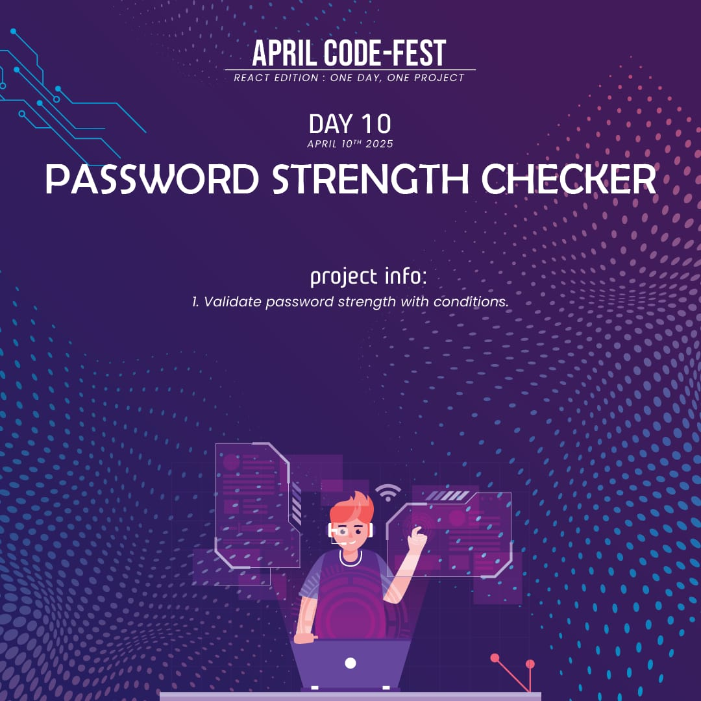
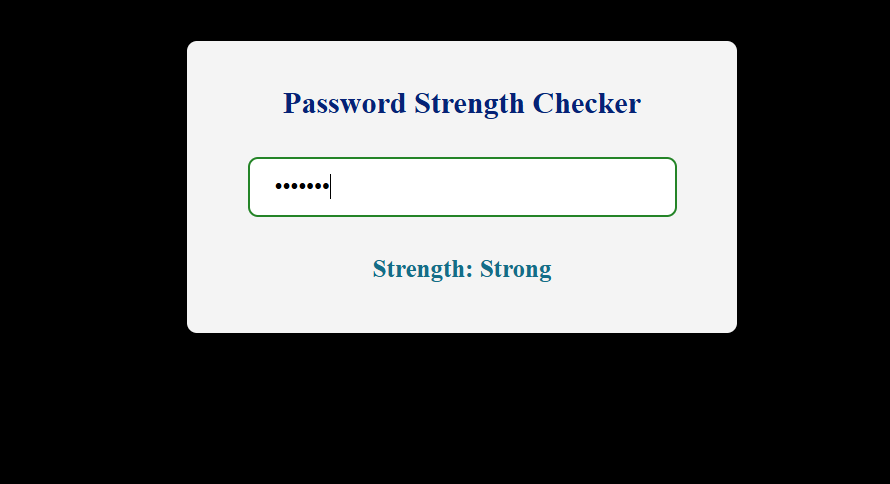

# 🔐 Password Strength Checker

A simple **React** application that checks how strong your password is and gives real-time feedback based on various criteria.

## 📌 Features
- ✅ **Real-Time Strength Check**: As users type, the app analyzes the password and provides instant feedback.
- ✅ **Score-Based Evaluation**: Passwords are evaluated based on length, use of uppercase, lowercase, numbers, and special characters.
- ✅ **Responsive Design**: Works smoothly across different screen sizes and devices.
- ✅ **Minimalist UI**: Clean and user-friendly interface for easy interaction.

## 🛠️ Technologies Used
- ⚛️ **React** (useState for handling input and dynamic strength checking)
- 🎨 **CSS** (for styling the password input and strength indicator)
- 📄 **HTML** (for structuring content)

## 🚀 Live Demo
To see it in action, clone the repository and follow the setup instructions below.

1. **Clone the repository:**

   ```bash
   git clone https://github.com/Eshhaa11/password-strength-checker
   
   
2. **Navigate to the project directory:**

   cd password-strength-checker

3. **Install dependencies:**

   npm install

4. **Start the development server:**

   npm start

5. **Open your browser and visit:**

   http://localhost:3000

 ## 🎨 Screenshots:
 

 ## 🤝 Contributing:
 Want to improve this project? Fork the repository, create a feature branch, and open a pull request. All contributions are welcome! 🚀✨

 🎉 Happy Coding!


